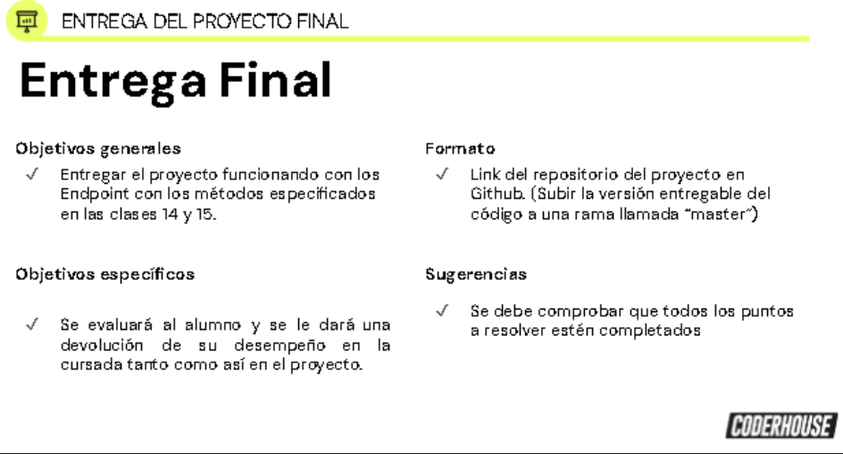
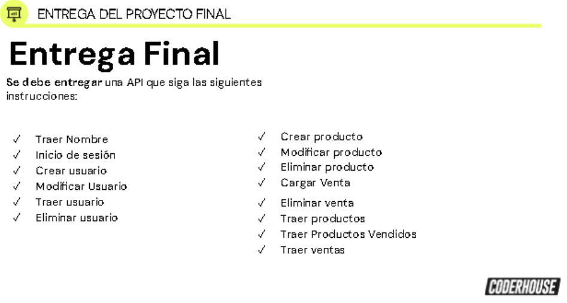

<h1> Proyecto Final C# CoderHouse</h1>
<h3>Ronnie Alvarez Castro 22/02/2024</h3>

Para el correcto uso de este proyecto debe tener la base de datos del proyecto
llamada Coderhouse o en la linea 22 del archivo program.cs esta el string de 
conexion de la dase de datos para que ajuste los parametros.
 
 
Adjunto a este proyecto en la carpeta POSTMAN Y BASEDATOS se encuentra un archivo de POSTMAN con el que se podra
probar esta API.
Y un script de la base de datos.

<h1>Curso C#: Proyecto Final
Mi propio sistema de gestión </h1>

Crearás el prototipo de tu primera aplicación web, en la cual participarán de
todo el back-end con C# para que sea posible el registro y logueo de nuevos 
usuarios, junto con el funcionamiento de la app.

Objetivo 1	Aplicar lógica computacional para desenvolverse con los comandos básicos en la resolución de problemas.
Objetivo 2	Manipular los objetos por modelos mostrando sus conocimientos en Programación Orientada a Objetos.
Objetivo 3	Administrar datos a través de listas.
Objetivo 4	Interactuar y comunicarse con la base de datos y el front end mediante APIs

Piezas sugeridas
Te recomendamos incluir:
Proyecto ASP.NET Core WebAPI
Una carpeta con todos los modelos (Las tablas de las bases de datos llevados a objetos y propiedades)
 
 
La API debe incluir los siguientes elementos:
Inicio de sesión: GET.
Crear usuario: POST.
Modificar usuario: PUT.
Traer usuario: GET.
Eliminar usuario: DELETE.
Crear tarea: POST.
Modificar tarea: PUT.
Eliminar tarea: DELETE.
Traer tareas/fecha de subida: GET.
Traer tareas/prioridad: GET.
Traer tareas/fecha obj.: GET.
Traer tareas vencidas: GET.
Traer tareas no vencidas: GET.
 
 

Requisitos base
Los requisitos base serán parte de los criterios de evaluación para aprobar el proyecto.
Crear una API que siga las siguientes instrucciones:
Traer Nombre: Se debe enviar un JSON al front que contenga únicamente  un string con el Nombre de la App a elección.
Inicio de sesión: Se le pasa como parámetro el nombre del usuario y la contraseña, buscar en la base de datos si el usuario existe y si coincide
con la contraseña lo devuelve, caso contrario devuelve error.
Crear usuario: Recibe como parámetro un JSON con todos los datos cargados y debe dar un alta inmediata del usuario con los mismos validando que todos
los datos obligatorios estén cargados, por el contrario, devolverá error (No se puede repetir el nombre de usuario. Pista... se puede usar el
"Traer Usuario" si se quiere reutilizar para corroborar si el nombre ya existe).
Modificar usuario: Se recibirán todos los datos del usuario por un JSON y se deberá modificar el mismo con los datos nuevos (No crear uno nuevo).
Traer Usuario: Debe recibir un nombre del usuario, buscarlo en la base de datos y devolver todos sus datos (Esto se hará para la página en la que se mostrara los
datos del usuario y en la página para modificar sus datos).
Eliminar Usuario: Recibe el ID del usuario a eliminar y lo deberá eliminar de la base de datos.
Crear producto: Recibe una lista de tareas por JSON, número de Id 0, Descripción, costo, precio venta y stock.
Modificar producto: Recibe un producto con su número de Id, debe modificarlo  con la nueva información.
Eliminar producto: Recibe el número de Id de un producto a eliminar y debe eliminarlo de la base de datos.
Cargar Venta: Recibe una lista de productos y el número de IdUsuario de quien la efectuó, primero cargar una nueva venta en la base de datos, luego debe 
cargar los productos recibidos en la base de ProductosVendidos uno por uno por un lado, y descontar el stock en la base de productos por el otro.
Eliminar Venta: Recibe una venta con su número de Id, debe buscar en la base de Productos Vendidos cuáles lo tienen eliminándolos, sumar el stock a los 
productos incluidos, y eliminar la venta de la base de datos.
Traer Productos: Debe traer todos los productos cargados en la base.
Traer Productos Vendidos: Traer Todos los productos vendidos de un Usuario, cuya información está en su producto (Utilizar dentro de esta función el 
"Traer Productos" anteriormente hecho para saber que productosVendidos ir a buscar).
Traer Ventas: Debe traer todas las ventas de la base, incluyendo sus Productos, cuya información está en ProductosVendidos.

Requisitos Extra
Los requisitos extra pro-coders no se incluyen en los criterios de evaluación.
Detectar y agregar validaciones no aclaradas y devolver un error en caso de que no se cumpla. Ej: Si ya hay un usuario con el mismo mail.
Armar funciones y objetos con nombres de fácil comprensión para reutilizar código y hacerlo más limpio.

Dont’s
No es necesario ni recomendado.
No incurrir en sobre-complejización del código (Más de 2 sentencias anidadas -if adentro de if adentro de if adentro de if-.
Repetición de código. Más de 500 líneas de código por API.
Nombres de variables y funciones poco claras. Código muerto), ya que se prioriza que se conserve la funcionalidad, aún siendo corto y sencillo.

